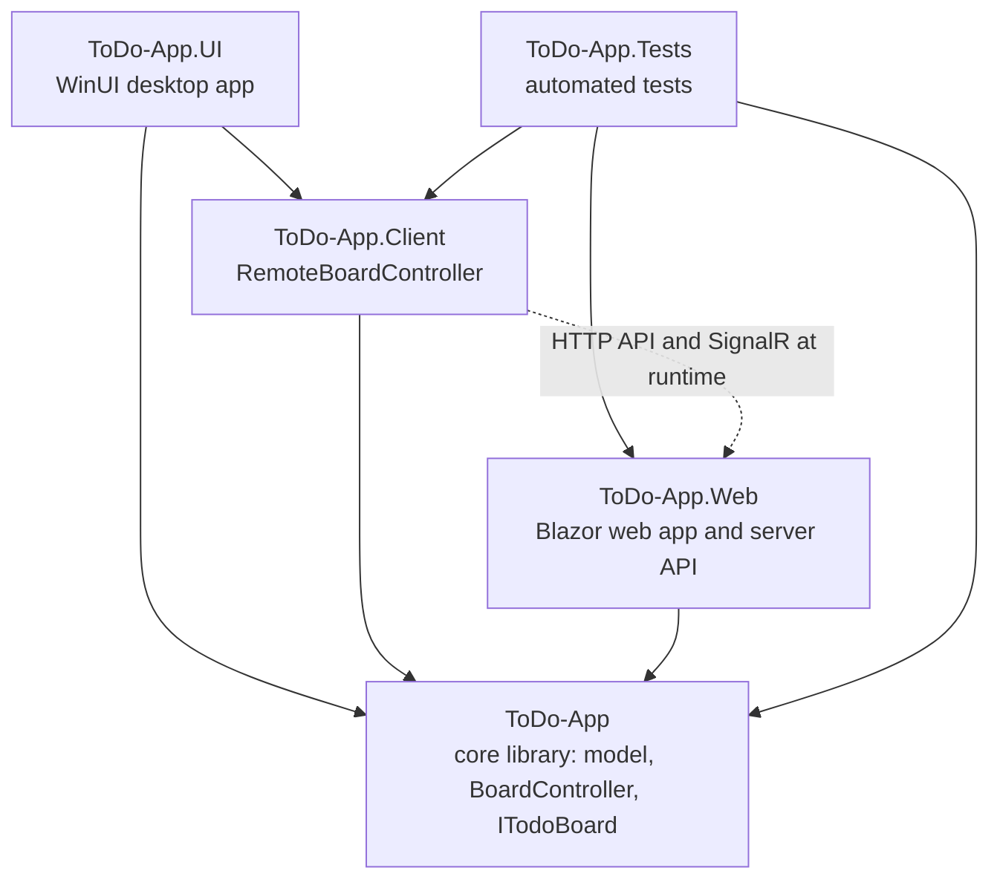

```mermaid
flowchart
    UI["ToDo-App.UI<br/>WinUI desktop app"]
    Web["ToDo-App.Web<br/>Blazor web app and server API"]
    Client["ToDo-App.Client<br/>RemoteBoardController"]
    Core["ToDo-App<br/>core library: model, BoardController, ITodoBoard"]
    Tests["ToDo-App.Tests<br/>automated tests"]

    UI --> Core
    UI --> Client
    Client --> Core
    Web --> Core
    Tests --> Core
    Tests --> Client
    Tests --> Web
    Client -. "HTTP API and SignalR at runtime" .-> Web
```