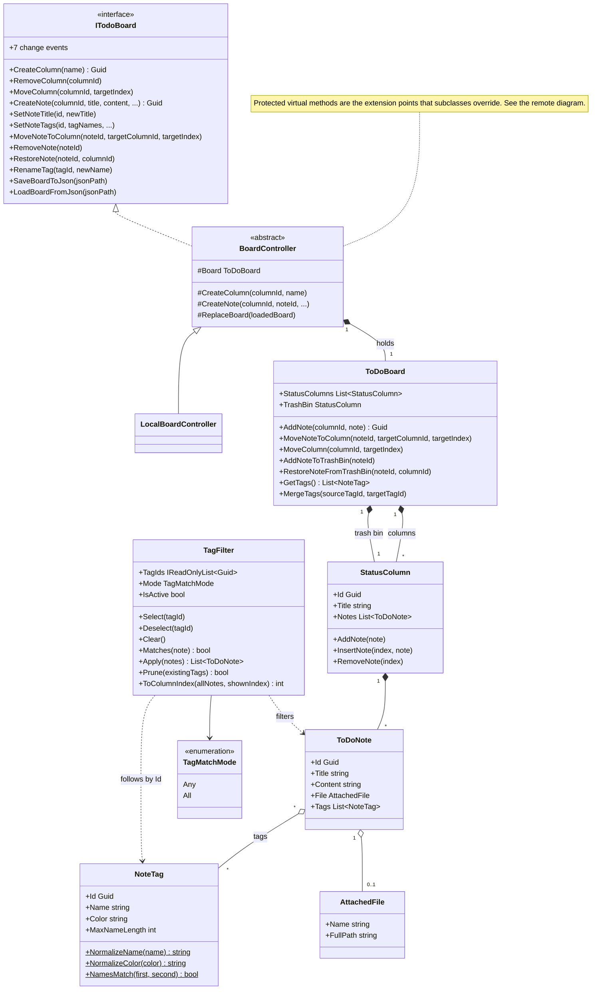

```mermaid
classDiagram
    direction TB

    class ITodoBoard {
        <<interface>>
        +7 change events
        +CreateColumn(name) Guid
        +RemoveColumn(columnId)
        +MoveColumn(columnId, targetIndex)
        +CreateNote(columnId, title, content, ...) Guid
        +SetNoteTitle(id, newTitle)
        +SetNoteTags(id, tagNames, ...)
        +MoveNoteToColumn(noteId, targetColumnId, targetIndex)
        +RemoveNote(noteId)
        +RestoreNote(noteId, columnId)
        +RenameTag(tagId, newName)
        +SaveBoardToJson(jsonPath)
        +LoadBoardFromJson(jsonPath)
    }

    class BoardController {
        <<abstract>>
        #Board ToDoBoard
        #CreateColumn(columnId, name)
        #CreateNote(columnId, noteId, ...)
        #ReplaceBoard(loadedBoard)
    }

    class LocalBoardController

    class ToDoBoard {
        +StatusColumns List~StatusColumn~
        +TrashBin StatusColumn
        +AddNote(columnId, note) Guid
        +MoveNoteToColumn(noteId, targetColumnId, targetIndex)
        +MoveColumn(columnId, targetIndex)
        +AddNoteToTrashBin(noteId)
        +RestoreNoteFromTrashBin(noteId, columnId)
        +GetTags() List~NoteTag~
        +MergeTags(sourceTagId, targetTagId)
    }

    class StatusColumn {
        +Id Guid
        +Title string
        +Notes List~ToDoNote~
        +AddNote(note)
        +InsertNote(index, note)
        +RemoveNote(index)
    }

    class ToDoNote {
        +Id Guid
        +Title string
        +Content string
        +File AttachedFile
        +Tags List~NoteTag~
    }

    class NoteTag {
        +Id Guid
        +Name string
        +Color string
        +MaxNameLength int
        +NormalizeName(name) string$
        +NormalizeColor(color) string$
        +NamesMatch(first, second) bool$
    }

    class AttachedFile {
        +Name string
        +FullPath string
    }

    class TagFilter {
        +TagIds IReadOnlyList~Guid~
        +Mode TagMatchMode
        +IsActive bool
        +Select(tagId)
        +Deselect(tagId)
        +Clear()
        +Matches(note) bool
        +Apply(notes) List~ToDoNote~
        +Prune(existingTags) bool
        +ToColumnIndex(allNotes, shownIndex) int
    }

    class TagMatchMode {
        <<enumeration>>
        Any
        All
    }

    ITodoBoard <|.. BoardController
    BoardController <|-- LocalBoardController
    BoardController "1" *-- "1" ToDoBoard : holds
    ToDoBoard "1" *-- "*" StatusColumn : columns
    ToDoBoard "1" *-- "1" StatusColumn : trash bin
    StatusColumn "1" *-- "*" ToDoNote
    ToDoNote "*" o-- "*" NoteTag : tags
    ToDoNote "1" o-- "0..1" AttachedFile
    TagFilter ..> ToDoNote : filters
    TagFilter ..> NoteTag : follows by Id
    TagFilter --> TagMatchMode

    note for BoardController "Protected virtual methods are the extension points that subclasses override. See the remote diagram."
```