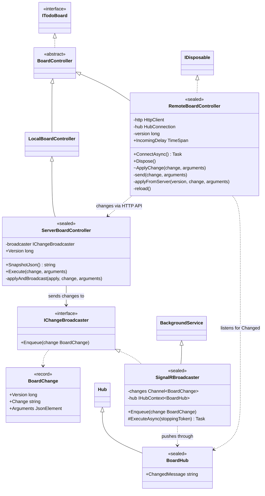

```mermaid
classDiagram
    direction TB

    class ITodoBoard {
        <<interface>>
    }

    class BoardController {
        <<abstract>>
    }

    class LocalBoardController

    class RemoteBoardController {
        <<sealed>>
        -http HttpClient
        -hub HubConnection
        -version long
        +IncomingDelay TimeSpan
        +ConnectAsync() Task
        +Dispose()
        ~ApplyChange(change, arguments)
        -send(change, arguments)
        -applyFromServer(version, change, arguments)
        -reload()
    }

    class ServerBoardController {
        <<sealed>>
        -broadcaster IChangeBroadcaster
        +Version long
        +SnapshotJson() string
        +Execute(change, arguments)
        -applyAndBroadcast(apply, change, arguments)
    }

    class IChangeBroadcaster {
        <<interface>>
        +Enqueue(change BoardChange)
    }

    class BoardChange {
        <<record>>
        +Version long
        +Change string
        +Arguments JsonElement
    }

    class SignalRBroadcaster {
        <<sealed>>
        -changes Channel~BoardChange~
        -hub IHubContext~BoardHub~
        +Enqueue(change BoardChange)
        #ExecuteAsync(stoppingToken) Task
    }

    class BoardHub {
        <<sealed>>
        +ChangedMessage string
    }

    ITodoBoard <|.. BoardController
    BoardController <|-- LocalBoardController
    BoardController <|-- RemoteBoardController
    LocalBoardController <|-- ServerBoardController
    IDisposable <|.. RemoteBoardController
    IChangeBroadcaster <|.. SignalRBroadcaster
    BackgroundService <|-- SignalRBroadcaster
    Hub <|-- BoardHub

    ServerBoardController --> IChangeBroadcaster : sends changes to
    IChangeBroadcaster ..> BoardChange
    SignalRBroadcaster ..> BoardHub : pushes through
    RemoteBoardController ..> ServerBoardController : changes via HTTP API
    RemoteBoardController ..> BoardHub : listens for Changed
```