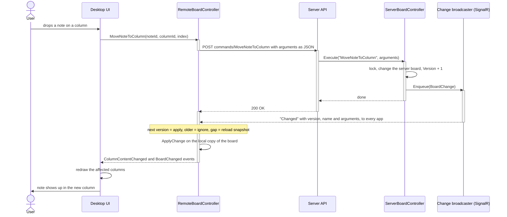

```mermaid
sequenceDiagram
    actor User
    participant UI as Desktop UI
    participant RC as RemoteBoardController
    participant API as Server API
    participant SC as ServerBoardController
    participant BC as Change broadcaster (SignalR)

    User->>UI: drops a note on a column
    UI->>RC: MoveNoteToColumn(noteId, columnId, index)
    activate RC
    RC->>API: POST commands/MoveNoteToColumn with arguments as JSON
    deactivate RC
    activate API
    API->>SC: Execute("MoveNoteToColumn", arguments)
    activate SC
    SC->>SC: lock, change the server board, Version + 1
    SC->>BC: Enqueue(BoardChange)
    activate BC
    SC-->>API: done
    deactivate SC
    API-->>RC: 200 OK
    activate RC
    deactivate API
    BC-->>RC: "Changed" with version, name and arguments, to every app
    deactivate BC
    Note over RC: next version = apply, older = ignore, gap = reload snapshot
    RC->>RC: ApplyChange on the local copy of the board
    RC-->>UI: ColumnContentChanged and BoardChanged events
    deactivate RC
    UI->>UI: redraw the affected columns
    UI ->> User: note shows up in the new column
```